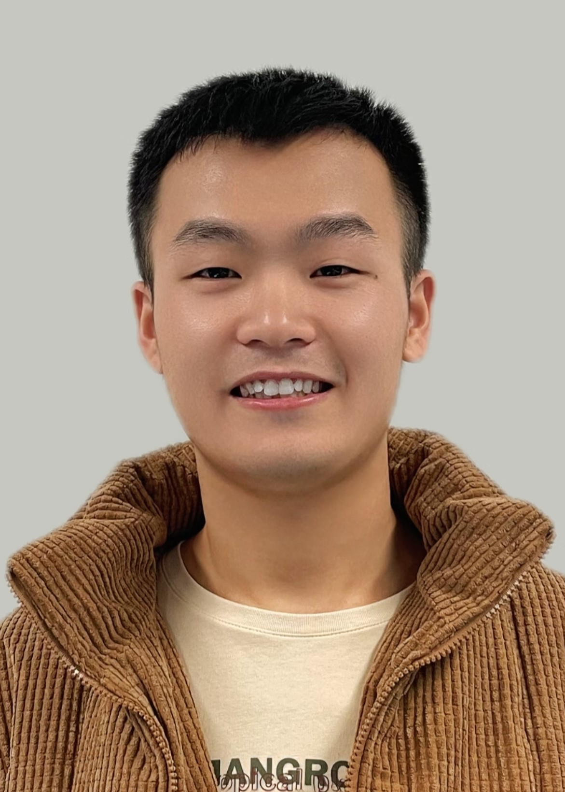
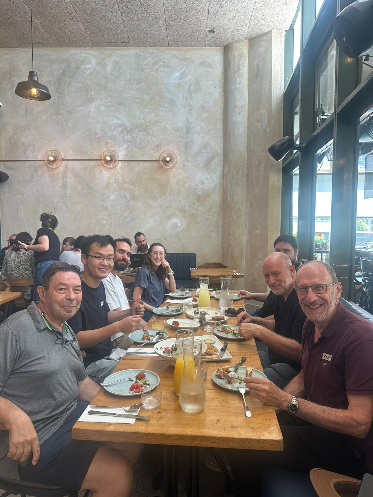
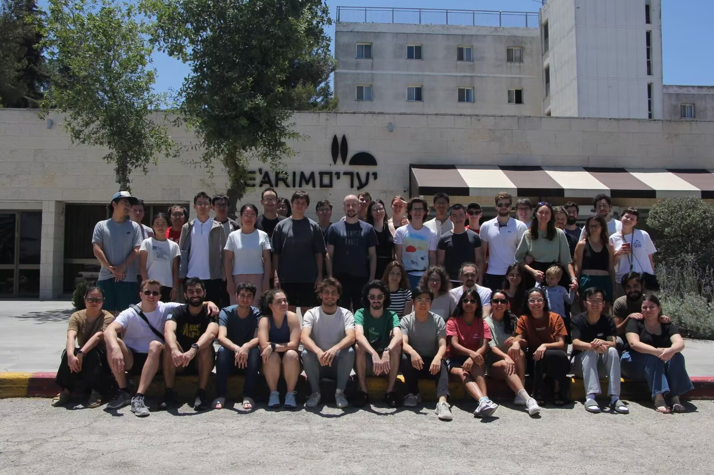
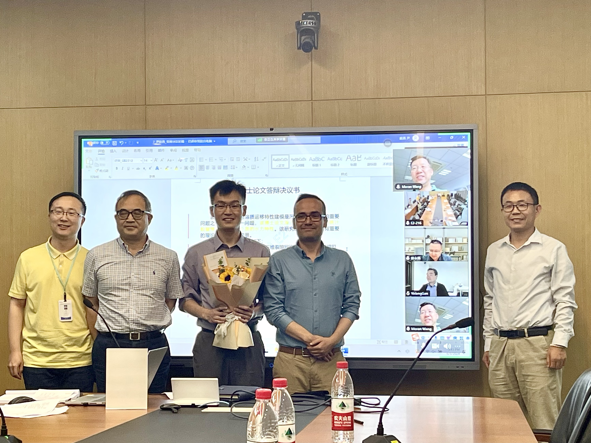
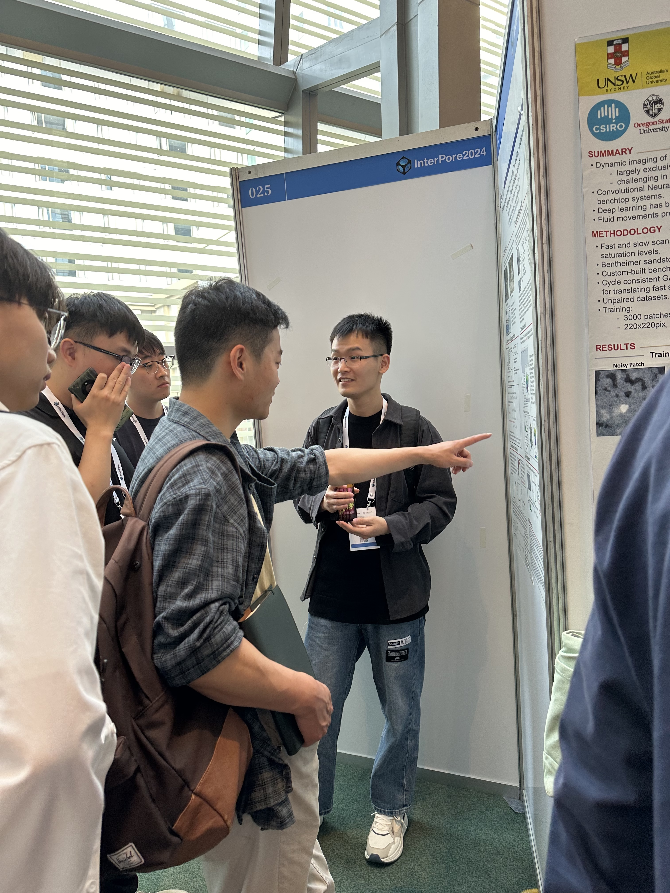

  
  

    <h2>Welcome to Tingchang's page</h2>
    
I am a Postdoctoral Fellow at the Weizmann Institute of Science, working under the guidance of <a href="https://www.weizmann.ac.il/EPS/Brian/">Brian Berkowitz</a>. I received my PhD degree from Zhejiang University, China, under the supervision of <a href="https://m3.westlake.edu.cn/">Sergio Torres</a> at Westlake University. I am studying flow and transport in fractured porous media.

  

      

### Education
- May 2025 - now, Azrieli postdoctoral fellow at the Weizmann Institute of Science
- Oct 2024 - May 2025, Postdoctoral fellow in Westlake University
- Sep 2020 - Jun 2024, PhD in Environmental Science and Engineering, Westlake University and Zhejiang University, Zhejiang, China (a joint program)
- Sep 2017 - Dec 2019, MEng in Mining, Guangxi University, Guangxi, China
- Sep 2013 - Jun 2017, BEng in Mineral Resource Engineering, Guangxi University, Guangxi, China

### Language
- Mandarin
- English

### Research Interests
- Flow and solute transport in fractured porous media
- High performance simulation
- Statistics of geological fractures
- Percolation theory
  
### Skills
- C/C++/CUDA/oneAPI
- Matlab
- Linux
- Python
  
### Publications

#### First author publications
- [T Yin, SA Galindo-Torres. Role of critical sets in the permeability of random fracture networks: A percolation scaling perspective (2025). Physical Review Research, 7, 043060](https://journals.aps.org/prresearch/abstract/10.1103/m38d-24dl)
- [T Yin, T Man, P Zhang, SA Galindo-Torres. GPU-accelerated simulation of steady-state flow and particle transport in discrete fracture networks (2025). Applied Computing and Geosciences, 100284](https://www.sciencedirect.com/science/article/pii/S2590197425000667)
- [T Yin, T Man, P Zhang, SA Galindo-Torres. Péclet‐Number‐Dependent Longitudinal Dispersion in Discrete Fracture Networks (2024). Water Resources Research, 60, e2024WR038437](https://doi.org/10.1029/2024WR038437)
- [T Yin, T Man, Ling Li, SA Galindo-Torres. Finite-Size Scaling for the Permeability of Discrete Fracture Networks (2023). Geophysical Research Letters, 50, e2022GL100837](https://agupubs.onlinelibrary.wiley.com/doi/10.1029/2022GL100837)
- [T Yin, T Man, SA Galindo-Torres. Universal scaling solution for the connectivity of discrete fracture networks (2022). Physica A: Statistical Mechanics and its Applications 599, 127495](https://www.sciencedirect.com/science/article/abs/pii/S0378437122003557)
- [T Yin, Q Chen. Simulation-based investigation on the accuracy of discrete fracture network (DFN) representation (2020). Computers and Geotechnics 121, 103487](https://www.sciencedirect.com/science/article/abs/pii/S0266352X20300501)

#### Co-authored publications
- [Tian, R., Yin, T., Tian, Y., Yu, C., Zhou, J., Gao, X., et al. (2024). Understanding heterogeneous and anisotropic porous media based on geometric properties derived from three-dimensional images. Water Resources Research, 60, e2024WR037205](https://doi.org/10.1029/2024WR037205)
- [Gao X, Tian R, Yin T, Torres SAG, Lei L. Pore-scale freezing of a sandy saline soil visualized with micro-computed tomography. Permafrost and Periglac Process. 2024; 1-16. doi:10.1002/ppp.2215](https://onlinelibrary.wiley.com/doi/10.1002/ppp.2215)
- [Jiang, Y., Yin, T., Guo, G., Gao, X., Torres, S. A. G., & Lei, L. (2024). Property evaluation by numerical modelling based on voxelized images–Accuracy versus resolution. Computers and Geotechnics, 165, 105887](https://www.sciencedirect.com/science/article/pii/S0266352X23006444)
- [Q Chen, T Yin. Modification of the rock mass rating system (RMRmbi) considering three-dimensional rock block size (2020). Bulletin of Engineering Geology and the Environment 79 (2), 789-810](https://link.springer.com/article/10.1007/s10064-019-01596-x)
- [Q Chen, T Yin. Should the use of rock quality designation be discontinued in the rock mass rating system? (2019). Rock Mechanics and Rock Engineering 52, 1075-1094](https://link.springer.com/article/10.1007/s00603-018-1607-x)
- [Q Chen, T Yin. Integration of homogeneous structural region identification and rock mass quality classification (2019). Royal Society Open Science 6 (1), 181353](https://royalsocietypublishing.org/doi/full/10.1098/rsos.181353)
- [Q Chen, T Yin, F Gao, Y Gao. Meticulous three-dimensional demarcation and separate presentation of statistically homogeneous structural domains within a large-scale jointed rock mass (2020). Geosciences Journal 24, 97-112](https://link.springer.com/article/10.1007/s12303-019-0007-x)

#### Books

- 陈庆发,尹庭昌. 裂隙岩体质量三维分区分级一体化理论与方法. 中南大学出版社 (2025)

### Honors and Awards
- National scholarship for Master Students, at Guangxi University, China (2019)
- Freshmen scholarship, at Westlake University, China (2020)
- Suwu scholarship, at Westlake University, China (2023)
- Excellent postgraduate student's award in Zhejiang University, China (2024)
- Excellent postgraduate student's award in Zhejiang province, received from Zhejiang Department of Education, China (2024)
- Azrieli international postdoctoral fellowship, Israel (2025)

### Gallery

  
  

    <h2>Group Fun Day - Sep 18, 2025</h2>
    
We enjoyed a wonderful lunch together, marking the first time I had the opportunity to share a meal with most of our group members.

  

  
  

    <h2>Hard Time - Jun 26, 2025</h2>
    
During the Twelve-Day War, international members of the Weizmann Institute of Science were relocated to a hotel in Jerusalem. Throughout the conflict, we gathered in underground shelters approximately three times each night. Over those twelve days, many sought various means to leave Israel, while some of us chose to remain. This is a group photo taken after the ceasefire agreement was reached. I was sitting in the front row, second from the right.

  

  
  

    <h2>PhD Defense - Jun 5, 2024</h2>
    
I successfully defended my doctoral dissertation on "Flow and Transport in Fractured Media." The defense committee was chaired by Professor Ling Li from Westlake University, with panel members including Professor Moran Wang from Tsinghua University, Professor Lingzao Zeng from Zhejiang University, Professor Yixiang Gan from The University of Sydney, and Professor Liang Lei from Westlake University.

  

  
  

    <h2>InterPore Conference Presentation - May 14, 2024</h2>
    
I presented my doctoral research at InterPore2024 (Qingdao, China), showcasing our in-house computational code and modeling framework for simulating flow and transport processes in 3D fracture networks.

  

